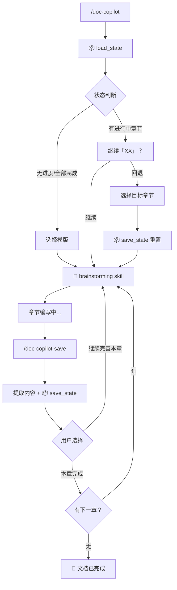
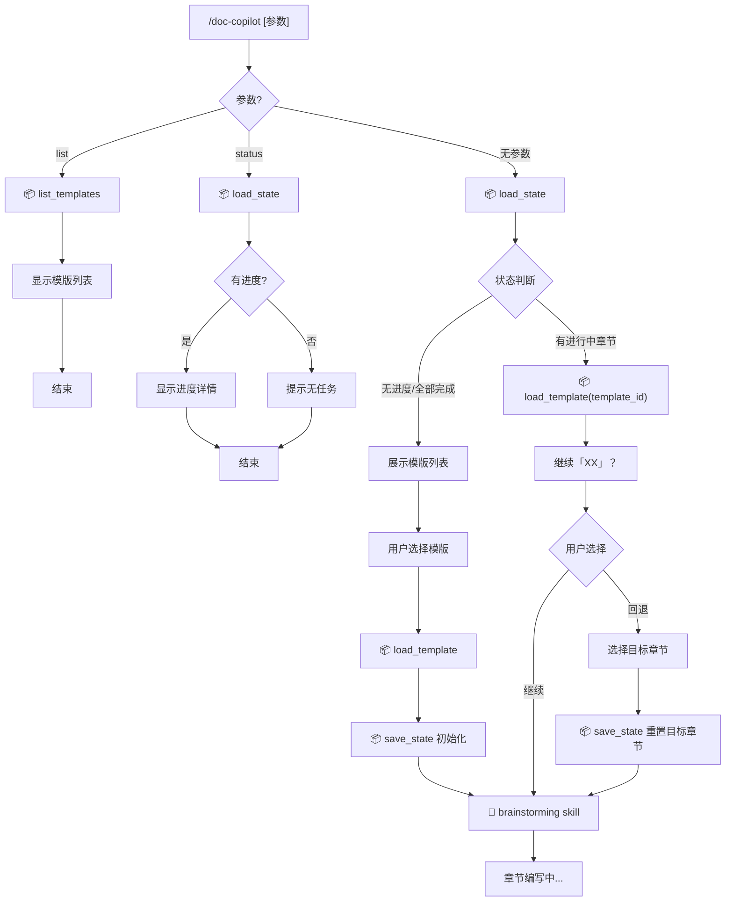
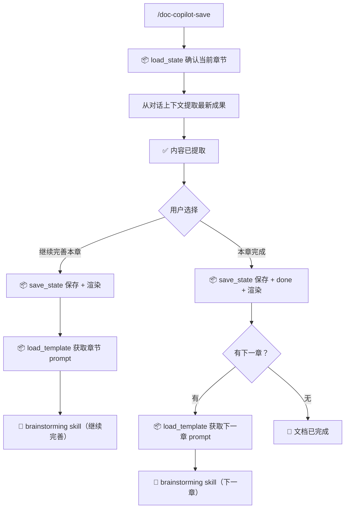

# Doc-Copilot Plugin 微型设计说明书 v1.6.0

> 版本: v1.6.0
> 创建时间: 2026-01-04
> 更新时间: 2026-01-07
> 标签: #claude-plugin #doc-copilot #micro-design

---
```table-of-contents
title: 
style: nestedList # TOC style (nestedList|nestedOrderedList|inlineFirstLevel)
minLevel: 0 # Include headings from the specified level
maxLevel: 0 # Include headings up to the specified level
include: 
exclude: 
includeLinks: true # Make headings clickable
hideWhenEmpty: false # Hide TOC if no headings are found
debugInConsole: false # Print debug info in Obsidian console
```
## 1. 介绍

### 1.1 目的

本文档描述 **Doc-Copilot Plugin** 的详细设计，该插件是 Claude Code 的扩展组件，用于实现 AI 协作文档编写框架。

**开发目标**：
- 将 Doc-Copilot 框架实现为独立的 Claude Code Plugin
- 提供可复用、可分发、可扩展的文档协作能力
- 支持按模版与 AI 交互式完成各类研发文档

**预期收益**：
- 统一的文档编写工作流
- 跨项目复用的模版系统
- 持久化的编写进度管理
- 可扩展的知识获取机制

### 1.2 术语与缩写

| 术语          | 说明                                           |
| ----------- | -------------------------------------------- |
| Doc-Copilot | AI 协作文档编写框架                                  |
| MCP         | Model Context Protocol，Claude 的工具扩展协议        |
| Skill       | Claude Code 技能组件，用于流程编排                      |
| Agent       | Claude Code 自主执行代理，用于复杂任务                    |
| Plugin      | Claude Code 插件，包含 Commands/Skills/Agents/MCP |
| 知识源         | 文档编写所需的上下文信息来源                               |
| 头脑风暴        | 人机交互确定内容方案的协作阶段                              |

### 1.3 参考文档

| 文档 | 说明 |
|------|------|
| [[Doc-Copilot框架设计]] | 框架整体设计和流程定义 |
| [[Doc-Copilot Plugin设计]] | Plugin 架构和组件设计 |
| [[架构设计任务流程设计]] | 原始需求和决策记录 |
| Claude Code Plugin 开发规范 | 官方插件开发指南 |

---

## 2. 模块方案概述

### 2.1 实现原理

Doc-Copilot Plugin 基于 Claude Code Plugin 体系构建，利用其提供的扩展机制实现完整的文档协作能力：

```
┌─────────────────────────────────────────────────────────┐
│                  Claude Code 核心                        │
├─────────────────────────────────────────────────────────┤
│  Plugin 加载器  │  执行引擎  │  MCP 通信层              │
└────────┬────────┴─────┬──────┴──────────┬───────────────┘
         │              │                 │
         ▼              ▼                 ▼
┌─────────────────────────────────────────────────────────┐
│                Doc-Copilot Plugin                        │
├─────────────────────────────────────────────────────────┤
│  Command          │  Skill(内置)       │  MCP Server    │
│  (入口触发)        │ (brainstorming)    │  (专用工具)    │
└─────────────────────────────────────────────────────────┘
```

**核心原理**：
- **Command** 作为用户入口触发器，解析参数并分发任务
- **Skill** 复用内置 brainstorming skill，通过定制 prompt 控制章节编写流程
- **MCP Server** 提供专用工具能力（模版、状态）

### 2.2 实现方案

**方案选型**：Command + Skill(brainstorming) + MCP

选择此方案的原因：
1. Command 提供简洁的用户入口，参数分发和状态查询
2. 复用内置 brainstorming skill 进行章节讨论
3. MCP Server 封装可复用的工具函数

**核心组件**：

| 组件                  | 类型        | 职责                         |
| ------------------- | --------- | -------------------------- |
| `/doc-copilot`      | Command   | 入口命令，调用 brainstorming 编写章节 |
| `/doc-copilot-save` | Command   | 保存章节，触发下一步流程               |
| `brainstorming`     | Skill(内置) | 章节讨论（大纲→内容），传入定制 prompt    |
| MCP Server          | Server    | 模版/状态工具集                   |

**模版系统**：
- YAML 配置格式，易于编写和维护
- 内置常用研发文档模版
- 支持用户自定义模版扩展

### 2.3 交互流程

> **核心理念**：Command 驱动，职责分离，人决定保存时机
>
> - `/doc-copilot`：流程控制入口（查看状态、进入章节）
> - `/doc-copilot-save`：保存章节内容 + 触发下一步

**设计原则**：
- **职责分离**：`/doc-copilot` 负责流程控制，`/doc-copilot-save` 负责保存触发
- **人决定保存**：用户输入 `/doc-copilot-save` 时才保存进度
- **章节为单元**：一个章节 = 头脑风暴 → 大纲 → 内容，完整流程
- **可重入**：任何时候 `/doc-copilot` 都能查看状态或继续

#### 2.3.1 命令概览

| 命令 | 职责 |
|------|------|
| `/doc-copilot` | 进入/继续流程（状态判断 → 选择章节 → 进入编写） |
| `/doc-copilot-save` | 保存当前章节 + 触发下一步流程 |
| `/doc-copilot list` | 列出所有可用模版 |
| `/doc-copilot status` | 查看当前进度 |

#### 2.3.2 总体流程



**图例**：`📦` MCP工具 | `🎯` Skill调用 | `🔍` 知识获取

#### 2.3.3 /doc-copilot 命令流程



**参数说明**：

| 参数 | 功能 | 输出示例 |
|------|------|----------|
| list | 显示所有可用模版 | `• micro-design - 微型设计说明书 (5 章节)` |
| status | 显示当前进度 | `进度：2/5 章节完成 (40%)，当前：模块详细设计` |
| 无参数 | 进入主流程 | 状态判断 → 用户选择 → 章节编写 |

**无参数时的状态判断（2 个分支）**：

| 状态条件 | 展示内容 | 用户选项 |
|----------|----------|----------|
| 无进度 / 全部完成 | "请选择文档模版" | 选择模版 |
| 有进行中章节 | "继续「XX」？" | 继续 / 回退 |

**用户操作（2 种）**：

| 操作 | 行为 |
|------|------|
| 继续 | 进入当前章节编写 |
| 回退 | 选择目标章节 → 重置该章节状态 → 进入编写 |

#### 2.3.4 /doc-copilot-save 命令流程



**核心职责**：

| 职责 | 说明 |
|------|------|
| 提取内容 | AI 自动从对话上下文提取最新成果（大纲/结论/内容） |
| 保存 + 渲染 | 保存到 `chapters[x].content`，同步渲染到输出文件 |
| 人决定下一步 | 用户选择 → 状态更新 → 触发对应动作 |

**用户选项**：

| 选项 | 状态变化 | 触发动作 |
|------|----------|----------|
| 继续完善本章 | 保持 `in_progress` | 保存渲染，重新触发 brainstorming（场景 2） |
| 本章完成 | 当前章节 → `done` | 保存渲染，有下一章进入（场景 1），无则完成 |

> **随时保存**：用户可在任何时候保存当前成果，每次都会渲染文档
> **暂停方式**：选择"继续完善本章"后直接结束对话，下次 `/doc-copilot` 自动恢复

#### 2.3.5 状态结构与设计说明

**状态结构**：

```yaml
template_id: micro-design
output: .ai-native/doc-copilot/micro-design.md
updated_at: 2026-01-06T10:30:00Z

chapters:
  - name: 介绍
    status: done
    content: "..."              # 保存的章节内容
  - name: 模块方案概述
    status: in_progress         # 当前正在编写
    phase: writing              # 当前阶段：brainstorming | outlining | writing
    outline_confirmed: true     # 大纲是否已确认
    content: "..."              # 已有内容（中途保存）
  - name: 模块详细设计
    status: pending
```

**阶段说明**：

| phase | 说明 |
|-------|------|
| brainstorming | 讨论理解目标、收集知识 |
| outlining | 形成大纲、等待确认 |
| writing | 大纲已确认，细化内容 |

**流程串联**：
1. `/doc-copilot` → 进入章节编写（触发 brainstorming）
2. 章节编写中（brainstorming 对话）...
3. 用户想保存 → `/doc-copilot-save` → 保存 + 渲染
4. 选择"继续完善" → 重新触发 brainstorming（场景 2）
5. 选择"本章完成" → 有下一章则进入（场景 1），无则完成
6. 下次 `/doc-copilot` → 检测到全部完成 → 选择新模版开始

**为什么可靠**：
- 保存时机由人决定，随时可保存当前成果
- 每次保存都渲染，随时可查看文档状态
- 下一步由人选择，完全掌控节奏
- Command 是明确的、无歧义的信号
- 状态外部化保证跨会话恢复
- 全部完成后选择新模版，状态自然被覆盖

> **暂停方式**：用户直接结束对话即可，下次 `/doc-copilot` 自动恢复
> **重置**：用户可手动删除 `.ai-native/doc-copilot/state.yaml`

#### 2.3.6 章节编写流程

章节编写通过调用 `brainstorming` skill 实现，传入定制的 prompt 控制完整流程。

> **触发方式**（根据 `content` 是否为空判断场景）：
> - `content` 为空（新开始、下一章、继续但未保存过）→ **场景 1**
> - `content` 非空（继续完善、回退到已完成章节）→ **场景 2**
>
> | 来源 | 条件 | 场景 |
> |------|------|------|
> | `/doc-copilot` | 新开始 / 下一章 | 场景 1 |
> | `/doc-copilot` | 继续（content 空） | 场景 1 |
> | `/doc-copilot` | 继续（content 非空） | 场景 2 |
> | `/doc-copilot` | 回退到已完成章节 | 场景 2 |
> | `/doc-copilot-save` | 继续完善本章 | 场景 2 |
> | `/doc-copilot-save` | 本章完成 → 有下一章 | 场景 1 |
>
> **完成条件**：用户输入 `/doc-copilot-save` 保存


**传入 brainstorming 的 prompt 模版**：

**场景 1：新开始 / 下一章**

```markdown
## 任务
编写「{章节名}」章节

## 章节描述
{来自模版的 prompt}

## 可用知识源（按需获取）
- user_input: {预设问题}
- codebase: {扫描路径}
- docs: {文档路径}
- web_search: {搜索关键词}
- context7: {技术文档查询}（可选）
- memory: {记忆标签}（可选）

## 流程要求
1. 先理解章节目标，有疑问向我提问
2. 讨论中如需知识，告诉我，我来获取
3. 形成大纲结构，等我确认后再继续
4. 大纲确认后，逐节细化内容
5. 内容满意后，提示我输入 `/doc-copilot-save` 保存

## 完成条件
- 大纲已确认 + 内容已完善 + 提示保存
- 在此之前，继续与我讨论，不要结束
```

**场景 2：继续完善 / 回退修改**

> 适用于：继续完善本章、回退到已完成章节

```markdown
## 任务
继续完善「{章节名}」章节

## 当前进度
- 阶段：{phase}（brainstorming/outlining/writing）
- 大纲已确认：{outline_confirmed}
- 已有内容：
{content 摘要或全文}

## 流程要求
1. 回顾之前的讨论和已有内容
2. 根据当前阶段继续：
   - brainstorming：继续讨论，收集知识
   - outlining：继续完善大纲，等我确认
   - writing：继续细化内容
3. 内容满意后，提示我输入 `/doc-copilot-save` 保存
4. 如果讨论较长，建议我中途保存以防丢失

## 完成条件
- 内容已完善 + 提示保存
- 在此之前，继续与我讨论，不要结束
```

**流程保障**：

| 机制 | 说明 |
|------|------|
| 明确阶段 | prompt 中定义"大纲→确认→内容→保存"流程 |
| 完成信号 | 只有提示 `/doc-copilot-save` 才算完成 |
| 用户控制 | 用户不输入 save 命令，讨论就继续 |
| 上下文保护 | 定期保存 + 状态外部化，防止上下文超长导致流程丢失 |

**上下文超长处理**：

当对话过长时，早期的 Skill prompt 可能被截断，导致 Claude "忘记"当前在 brainstorming。

| 情况 | 会打断 | 处理方式 |
|------|--------|----------|
| 用户输入 Command | ✅ 是 | `/doc-copilot-save` 已设计为重新触发 brainstorming |
| 用户调用其他 Skill | ✅ 是 | 用户自主选择，无需处理 |
| 对话上下文超长 | ✅ 是 | 状态外部化 + 定期保存（见下方） |
| Claude 调用工具 | ❌ 否 | 工具调用不改变行为模式 |
| 用户普通对话 | ❌ 否 | brainstorming 正常交互 |

**解决方案：状态外部化 + 定期保存**

1. **状态中记录阶段信息**：不仅保存内容，还保存当前讨论阶段
2. **场景 2 prompt 阶段感知**：重新触发时，prompt 传入阶段信息，无缝继续
3. **提示定期保存**：prompt 中提示 Claude 建议用户中途保存

**知识获取类型**（模版 `knowledge_sources` 配置，惰性加载）：

| 类型 | 说明 | 依赖 |
|------|------|------|
| user_input | 向用户提问（模版预设问题） | 内置 |
| codebase | 探索代码结构/API/模式 | 内置 |
| docs | 读取相关文档 | 内置 |
| web_search | 搜索最佳实践 | 内置 |
| context7 | 技术文档查询 | Context7 MCP（可选） |
| memory | 历史决策记忆 | Memory MCP（可选） |

---

## 3. 模块详细设计

### 3.1 目录结构

> 采用 [[Monorepo 结构说明|Monorepo 结构]]，doc-copilot 是 ai-native 仓库的子模块

```
ai-native/                             # 主仓库
├── README.md
├── LICENSE
│
└── doc-copilot/                       # 文档协作插件模块
    ├── .claude-plugin/
    │   └── plugin.json                # Plugin 元数据
    │
    ├── .mcp.json                      # MCP Server 配置
    │
    ├── commands/
    │   ├── doc-copilot.md             # /doc-copilot 入口命令
    │   └── doc-copilot-save.md        # /doc-copilot-save 保存命令
    │
    ├── mcp-server/                    # MCP Server 实现
    │   ├── package.json
    │   ├── tsconfig.json
    │   ├── src/
    │   │   ├── index.ts               # 入口
    │   │   └── tools/
    │   │       ├── template.ts        # 模版工具（list_templates, load_template）
    │   │       └── state.ts           # 状态工具（save_state, load_state）
    │   └── dist/                      # 编译产物（npm run bundle 生成）
    │       └── index.js
    │
    ├── templates/                     # 内置模版
    │   ├── system-requirements.yaml
    │   └── micro-design.yaml
    │
    └── README.md

# 用户项目目录（运行时生成）
user-project/
└── .ai-native/                        # ai-native 统一目录
    └── doc-copilot/
        ├── state.yaml                 # 进度状态文件
        ├── templates/                 # 用户自定义模版（可选）
        │   └── *.yaml
        └── *.md                       # 输出的文档文件（如 micro-design.md）
```

**用户自定义模版**：
- 用户模版放在项目目录 `.ai-native/doc-copilot/templates/`
- 同名模版会覆盖内置模版（本地优先）

### 3.2 构建与部署

> 采用**单文件打包**策略：使用 esbuild 将依赖打包进 `dist/index.js`，用户无需 `npm install`

#### 3.2.1 用户安装（一键完成）

```bash
claude plugins install github:sasacoder/ai-native/doc-copilot
```

安装后即可使用，无需额外步骤。

**安装内容**：
```
~/.claude/plugins/doc-copilot/
├── .claude-plugin/
│   └── plugin.json               # 插件元数据
├── .mcp.json                     # MCP 配置
├── commands/
│   ├── doc-copilot.md
│   └── doc-copilot-save.md
├── mcp-server/
│   └── dist/
│       └── index.js              # 单文件打包（含所有依赖）
└── templates/                    # 内置模版
    ├── system-requirements.yaml
    └── micro-design.yaml
```

#### 3.2.2 安装验证

```bash
# 列出可用模版，验证插件是否正常工作
/doc-copilot list
```

预期输出：
```
可用模版：
  • micro-design - 微型设计说明书 (5 章节)
  • system-requirements - 系统需求规格说明书 (8 章节)
```

#### 3.2.3 用户初始化流程

首次使用时：

1. 在项目目录执行 `/doc-copilot`
2. 选择文档模版
3. 开始第一章编写（进入 brainstorming）
4. 进度自动保存到 `.ai-native/doc-copilot/state.yaml`

> 详细交互流程参见 [2.3 交互流程](#23-交互流程)

#### 3.2.4 开发者构建流程

```bash
# 克隆仓库
git clone https://github.com/sasacoder/ai-native.git
cd ai-native/doc-copilot/mcp-server

# 安装依赖
npm install

# 开发模式（监听文件变化，自动编译）
npm run dev

# 本地测试（编译后需配合 node_modules 运行）
npm run build
```

#### 3.2.5 开发者发布流程

```bash
# 1. 打包成单文件（含所有依赖，用户无需 npm install）
npm run bundle

# 2. 提交打包产物
git add dist/
git commit -m "build: update dist"

# 3. 推送发布
git push
```

> 注意：发布时使用 `bundle` 而非 `build`，确保依赖打包进单文件

### 3.3 Plugin 元数据

**plugin.json**：

```json
{
  "name": "doc-copilot",
  "description": "AI 协作文档编写框架 - 按模版与 AI 交互式完成研发文档",
  "version": "1.0.0",
  "author": {
    "name": "sasacoder",
    "url": "https://github.com/sasacoder"
  },
  "repository": {
    "type": "git",
    "url": "https://github.com/sasacoder/ai-native",
    "directory": "doc-copilot"
  },
  "license": "MIT",
  "keywords": ["documentation", "ai-collaboration", "templates", "ai-native"]
}
```

> 注：ai-native 采用 [[Monorepo 结构说明|Monorepo 结构]]，doc-copilot 是其中一个模块

**.mcp.json**：

> 配置文件放在模块目录内，路径相对于 `doc-copilot/`，保证模块独立可安装

```json
{
  "mcpServers": {
    "doc-copilot": {
      "type": "stdio",
      "command": "node",
      "args": ["./mcp-server/dist/index.js"],
      "env": {
        "TEMPLATES_DIR": "./templates",
        "STATE_DIR": ".ai-native/doc-copilot",
        "STATE_FILE": "state.yaml"
      }
    }
  }
}
```

> 路径说明：
> - `TEMPLATES_DIR`：内置模版目录，相对于插件安装目录
> - `STATE_DIR/STATE_FILE`：相对于用户项目目录（由 MCP 工具拼接 project_path）
> - 用户模版目录：`{project_path}/.ai-native/doc-copilot/templates/`（代码中硬编码，与 STATE_DIR 同级）

### 3.4 Command 设计

> 命令名称从文件名自动导出：`doc-copilot.md` → `/doc-copilot`

#### 3.4.1 /doc-copilot 命令

**commands/doc-copilot.md**：

```markdown
---
description: AI 协作文档编写 - 按模版交互式完成研发文档
argument-hint: [status|list]
allowed-tools: Skill, mcp__doc-copilot__list_templates, mcp__doc-copilot__load_template, mcp__doc-copilot__load_state, mcp__doc-copilot__save_state
---

# Doc-Copilot 命令

入口命令，根据 `$ARGUMENTS` 参数分发到不同处理分支。

## 分支1：`$ARGUMENTS` = "list"

📦 调用 `list_templates`，显示可用模版列表后结束。

## 分支2：`$ARGUMENTS` = "status"

📦 调用 `load_state`：
- 有进度：显示当前模版、章节完成情况、上次编辑时间
- 无进度：提示"暂无进行中的文档任务"

## 分支3：无参数（主流程）

1. 📦 调用 `load_state` 检查状态
2. 状态判断：
   - **无进度/全部完成**：📦 `list_templates` → 用户选择模版 → 📦 `load_template` → 📦 `save_state` 初始化
   - **有进行中章节**：📦 `load_template(state.template_id)` → 询问用户「继续」或「回退」
3. 构造定制 prompt（从模版和状态组装，参见 [2.3.6 章节编写流程](#236-章节编写流程)）
4. 🎯 调用 `brainstorming` skill，定制 prompt 作为对话上下文传递

**定制 prompt 传递机制**：
- Claude 按 Command 指示，先输出定制 prompt 作为任务说明
- 然后调用 `Skill(brainstorming)`
- brainstorming skill 看到上下文中的任务说明，按此执行章节编写流程

> 详细流程参见 [2.3.3 /doc-copilot 命令流程](#233-doc-copilot-命令流程)
```

#### 3.4.2 /doc-copilot 测试用例

| 用例 | 输入 | 场景 | 预期结果 |
|------|------|------|----------|
| TC-1 | `/doc-copilot` | 主流程入口（无进度） | 选择模版 → 初始化 → brainstorming |
| TC-1b | `/doc-copilot` | 主流程入口（有进度，继续） | 确认继续 → brainstorming |
| TC-1c | `/doc-copilot` | 主流程入口（有进度，回退） | 选择目标章节 → 重置 → brainstorming |
| TC-2 | `/doc-copilot list` | 列出模版 | 显示所有可用模版 |
| TC-3 | `/doc-copilot status` | 查看进度（有） | 显示进度详情 |
| TC-4 | `/doc-copilot status` | 查看进度（无） | 提示无任务 |

<details>
<summary>测试用例详情</summary>

**TC-1：主流程入口（无进度）**
```
输入: /doc-copilot
📦 load_state → { exists: false }
📦 list_templates → 展示模版列表
用户选择: micro-design
📦 load_template("micro-design") → 模版配置
📦 save_state → 初始化状态
🎯 brainstorming skill（传入定制 prompt，场景 1）
（后续流程见 2.3.6 章节编写流程）
```

**TC-1b：主流程入口（有进度，继续）**
```
输入: /doc-copilot
📦 load_state → { exists: true, template_id: "micro-design", 当前章节: 模块详细设计 (3/5), content: "..." }
📦 load_template(state.template_id) → 模版配置
提示: 继续「模块详细设计」？
用户选择: 继续
🎯 brainstorming skill（传入定制 prompt，场景 2）
```

**TC-1c：主流程入口（有进度，回退）**
```
输入: /doc-copilot
📦 load_state → { exists: true, template_id: "micro-design", 当前章节: 模块详细设计 (3/5) }
📦 load_template(state.template_id) → 模版配置
提示: 继续「模块详细设计」？
用户选择: 回退
展示章节列表，用户选择: 介绍
📦 save_state → 重置「介绍」章节状态
🎯 brainstorming skill（传入定制 prompt，场景 2）
```

**TC-2：列出模版**
```
输入: /doc-copilot list
📦 list_templates → 模版列表

输出: 可用模版：
  • micro-design - 微型设计说明书 (5 章节)
  • system-requirements - 系统需求规格说明书 (8 章节)
```

**TC-3：查看进度（有）**
```
输入: /doc-copilot status
📦 load_state → { exists: true, ... }

输出: 当前进度：微型设计说明书
  进度：2/5 章节完成 (40%)
  当前：模块详细设计
  上次编辑：2026-01-06 10:30
```

**TC-4：查看进度（无）**
```
输入: /doc-copilot status
📦 load_state → { exists: false }

输出: 暂无进行中的文档任务
```

</details>

#### 3.4.3 /doc-copilot-save 命令

**commands/doc-copilot-save.md**：

```markdown
---
description: 保存当前章节并触发下一步流程
allowed-tools: Skill, mcp__doc-copilot__load_state, mcp__doc-copilot__load_template, mcp__doc-copilot__save_state
---

# Doc-Copilot Save 命令

保存当前章节内容，并触发下一步流程。

## 执行流程

1. 📦 调用 `load_state` 确认当前章节
2. 从当前对话上下文提取章节内容
3. 展示选项：「继续完善本章」或「本章完成」
4. 根据用户选择执行保存和后续流程

## 用户选择

### 选项1：继续完善本章

📦 调用 `save_state`（保存 content，保持 in_progress，渲染文档）
📦 调用 `load_template(state.template_id)` 获取章节 prompt
构造定制 prompt（场景 2，参见 [2.3.6](#236-章节编写流程)）
🎯 调用 `brainstorming` skill，定制 prompt 作为对话上下文传递

### 选项2：本章完成

📦 调用 `save_state`（保存 content，设置 done，渲染文档）
→ 有下一章：📦 `load_template` 获取下一章 prompt → 构造定制 prompt（场景 1）→ 🎯 调用 `brainstorming` skill
→ 无下一章：🎉 文档已完成

> 详细流程参见 [2.3.4 /doc-copilot-save 命令流程](#234-doc-copilot-save-命令流程)
```

#### 3.4.4 /doc-copilot-save 测试用例

| 用例 | 输入 | 场景 | 预期结果 |
|------|------|------|----------|
| TC-S1 | `/doc-copilot-save` | 继续完善本章 | save_state + 渲染 → brainstorming（场景 2） |
| TC-S2 | `/doc-copilot-save` | 本章完成（有下一章） | save_state + done + 渲染 → brainstorming 下一章（场景 1） |
| TC-S3 | `/doc-copilot-save` | 本章完成（最后一章） | save_state + done + 渲染 → 文档完成 |

<details>
<summary>测试用例详情</summary>

**TC-S1：继续完善本章**
```
输入: /doc-copilot-save
📦 load_state → { exists: true, template_id: "micro-design", 当前章节: 介绍 (1/5) }
提取内容: "当前大纲..."

输出: ✅ 内容已提取

     下一步？
     [1] 继续完善本章
     [2] 本章完成

用户选择: 1
📦 save_state(content: "...", render: true)
→ 文档已渲染到 .ai-native/doc-copilot/micro-design.md
📦 load_template(state.template_id) → 获取章节 prompt
🎯 brainstorming skill（传入定制 prompt，场景 2）
```

**TC-S2：本章完成（有下一章）**
```
输入: /doc-copilot-save
📦 load_state → { exists: true, template_id: "micro-design", 当前章节: 介绍 (1/5) }
提取内容: "完整内容..."

输出: ✅ 内容已提取

     下一步？
     [1] 继续完善本章
     [2] 本章完成

用户选择: 2
📦 save_state(status: "done", render: true)
→ 文档已渲染
📦 load_template(state.template_id) → 获取下一章 prompt
🎯 brainstorming skill（传入定制 prompt，场景 1）
→ 进入「模块方案概述」的头脑风暴
```

**TC-S3：本章完成（最后一章）**
```
输入: /doc-copilot-save
📦 load_state → { exists: true, template_id: "micro-design", 当前章节: 变更控制 (5/5) }
提取内容: "完整内容..."

输出: ✅ 内容已提取

     下一步？
     [1] 继续完善本章
     [2] 本章完成

用户选择: 2
📦 save_state(status: "done", render: true)

输出: 🎉 文档已完成：.ai-native/doc-copilot/micro-design.md
     共 5 章节
```

</details>

### 3.5 Skill 设计

> **v1.5.0 变更**：不再自定义 Skill，直接复用内置 `brainstorming` skill

**设计决策**：

| 方案 | 说明 | 问题 |
|------|------|------|
| 自定义 doc-chapter skill | 封装章节编写流程 | 需要嵌套调用 brainstorming，可能搞乱 |
| **直接复用 brainstorming** | 传入定制 prompt 控制流程 | ✅ 无嵌套，流程清晰 |

**实现方式**：

`/doc-copilot` 命令在确定章节后，调用 `brainstorming` skill 并传入定制 prompt：

```
Skill(brainstorming) + 定制 prompt
    │
    ├── 任务：编写「{章节名}」
    ├── 章节描述：{模版 prompt}
    ├── 可用知识源：{knowledge_sources}
    ├── 流程要求：大纲→确认→内容→提示保存
    └── 完成条件：提示 /doc-copilot-save 保存
```

**流程保障**（借鉴 ralph-loop 思路）：

| 机制 | 说明 |
|------|------|
| 明确完成条件 | prompt 中要求"提示 /doc-copilot-save 才算完成" |
| 阶段约束 | "大纲未确认前不细化内容" |
| 用户控制退出 | 只有用户输入 save 命令才结束 |

**依赖**：

| Skill | 来源 | 用途 |
|-------|------|------|
| brainstorming | 内置 / superpowers 插件 | 章节讨论式编写 |

### 3.6 MCP Server 设计

**mcp-server/package.json**：

```json
{
  "name": "doc-copilot-mcp",
  "version": "1.0.0",
  "type": "module",
  "main": "dist/index.js",
  "scripts": {
    "build": "tsc",
    "bundle": "esbuild src/index.ts --bundle --platform=node --outfile=dist/index.js",
    "dev": "tsc --watch"
  },
  "dependencies": {
    "@modelcontextprotocol/sdk": "^1.0.0",
    "yaml": "^2.0.0",
    "zod": "^3.0.0"
  },
  "devDependencies": {
    "typescript": "^5.0.0",
    "@types/node": "^20.0.0",
    "esbuild": "^0.20.0"
  }
}
```

**package.json 字段说明**：

| 字段 | 作用 | 本项目配置 |
|------|------|------------|
| `name` | 包名称 | `doc-copilot-mcp` |
| `type` | 模块类型 | `module`（使用 ES Module 语法） |
| `main` | 入口文件 | `dist/index.js`（MCP Server 启动入口） |
| `scripts` | npm 脚本命令 | `build`/`bundle`/`dev` |
| `dependencies` | 运行时依赖 | MCP SDK、yaml 解析、zod 校验 |
| `devDependencies` | 开发时依赖 | TypeScript、esbuild 打包 |

> 使用 `npm run bundle` 将所有依赖打包成单文件，用户安装后无需 `npm install`

**mcp-server/tsconfig.json**：

```json
{
  "compilerOptions": {
    "target": "ES2022",
    "module": "NodeNext",
    "moduleResolution": "NodeNext",
    "outDir": "dist",
    "rootDir": "src",
    "strict": true,
    "esModuleInterop": true,
    "skipLibCheck": true
  },
  "include": ["src/**/*"]
}
```

**编译与打包流程**：

| 命令 | 作用 | 产物 | 使用场景 |
|------|------|------|----------|
| `npm run build` | TypeScript 编译 | `dist/*.js` + 依赖分离 | 本地开发测试 |
| `npm run bundle` | esbuild 单文件打包 | `dist/index.js`（含所有依赖） | 发布分发 |
| `npm run dev` | 监听模式编译 | 同 build | 开发调试 |

```
src/                          npm run bundle
├── index.ts         ──────────────────────►  dist/index.js
└── tools/                                    (单文件，含所有依赖)
    ├── template.ts
    └── state.ts
```

**工具清单**：

| 工具 | 参数 | 返回值 | 功能 |
|------|------|--------|------|
| `list_templates` | project_path | 模版列表 | 列出所有可用模版（内置 + 用户） |
| `load_template` | template_id, project_path | 模版配置 | 加载指定模版（本地优先） |
| `save_state` | project_path, state, render? | 成功/失败 + 文件路径 | 保存进度状态，可选渲染文档 |
| `load_state` | project_path | 状态数据 | 加载进度状态 |

> **设计说明**：流程控制逻辑在 Skill 内部实现，MCP 工具只负责数据操作（读写状态、模版）。渲染功能内置于 `save_state` 的 `render` 参数。

**入口文件 (src/index.ts)**：

```typescript
import { McpServer } from "@modelcontextprotocol/sdk/server/mcp.js";
import { StdioServerTransport } from "@modelcontextprotocol/sdk/server/stdio.js";
import { listTemplates, loadTemplate } from "./tools/template.js";
import { saveState, loadState } from "./tools/state.js";

const server = new McpServer({
  name: "doc-copilot",
  version: "1.0.0"
});

// 注册工具
[listTemplates, loadTemplate, saveState, loadState].forEach(tool => {
  server.tool(
    tool.name,
    tool.description,
    tool.parameters.shape,
    tool.execute
  );
});

// 启动服务
const transport = new StdioServerTransport();
await server.connect(transport);
```

**模版工具 (src/tools/template.ts)**：

```typescript
import { z } from "zod";
import * as yaml from "yaml";
import * as fs from "fs/promises";
import * as path from "path";

const BUILTIN_TEMPLATES_DIR = process.env.TEMPLATES_DIR || "./templates";
const USER_TEMPLATES_SUBDIR = ".ai-native/doc-copilot/templates";

export const listTemplates = {
  name: "list_templates",
  description: "列出所有可用的文档模版（内置 + 用户）",
  parameters: z.object({
    project_path: z.string().describe("项目目录路径")
  }),
  async execute({ project_path }) {
    const templates = new Map(); // 用 Map 实现本地优先

    // 1. 先加载内置模版
    const builtinFiles = await fs.readdir(BUILTIN_TEMPLATES_DIR).catch(() => []);
    for (const file of builtinFiles) {
      if (file.endsWith(".yaml")) {
        const content = await fs.readFile(
          path.join(BUILTIN_TEMPLATES_DIR, file), "utf-8"
        );
        const config = yaml.parse(content);
        templates.set(config.id, {
          id: config.id,
          name: config.name,
          description: config.description,
          chapters_count: config.chapters.length,
          source: "builtin"
        });
      }
    }

    // 2. 再加载用户模版（覆盖同名内置模版）
    const userTemplatesDir = path.join(project_path, USER_TEMPLATES_SUBDIR);
    const userFiles = await fs.readdir(userTemplatesDir).catch(() => []);
    for (const file of userFiles) {
      if (file.endsWith(".yaml")) {
        const content = await fs.readFile(
          path.join(userTemplatesDir, file), "utf-8"
        );
        const config = yaml.parse(content);
        templates.set(config.id, {
          id: config.id,
          name: config.name,
          description: config.description,
          chapters_count: config.chapters.length,
          source: "user"
        });
      }
    }

    return Array.from(templates.values());
  }
};

export const loadTemplate = {
  name: "load_template",
  description: "加载指定模版的完整配置（本地优先）",
  parameters: z.object({
    template_id: z.string().describe("模版 ID"),
    project_path: z.string().describe("项目目录路径")
  }),
  async execute({ template_id, project_path }) {
    // 1. 先尝试用户模版
    const userPath = path.join(
      project_path, USER_TEMPLATES_SUBDIR, `${template_id}.yaml`
    );
    try {
      const content = await fs.readFile(userPath, "utf-8");
      return yaml.parse(content);
    } catch {}

    // 2. 回退到内置模版
    const builtinPath = path.join(BUILTIN_TEMPLATES_DIR, `${template_id}.yaml`);
    const content = await fs.readFile(builtinPath, "utf-8");
    return yaml.parse(content);
  }
};
```

**状态管理 (src/tools/state.ts)**：

```typescript
const STATE_DIR = process.env.STATE_DIR || ".ai-native/doc-copilot";
const STATE_FILE = process.env.STATE_FILE || "state.yaml";

export const saveState = {
  name: "save_state",
  description: "保存文档编写进度状态，可选渲染文档",
  parameters: z.object({
    project_path: z.string(),
    state: z.object({
      template_id: z.string(),
      output: z.string(),
      chapters: z.array(z.object({
        name: z.string(),
        status: z.enum(["pending", "in_progress", "done"]),
        phase: z.enum(["brainstorming", "outlining", "writing"]).optional(),
        outline_confirmed: z.boolean().optional(),
        content: z.string().optional()
      }))
    }),
    render: z.boolean().optional().describe("是否同步渲染文档")
  }),
  async execute({ project_path, state, render }) {
    const stateDir = path.join(project_path, STATE_DIR);
    const statePath = path.join(stateDir, STATE_FILE);

    // 确保目录存在
    await fs.mkdir(stateDir, { recursive: true });

    const content = yaml.stringify({
      ...state,
      updated_at: new Date().toISOString()
    });
    await fs.writeFile(statePath, content);

    let outputPath = null;
    if (render) {
      // 渲染文档
      outputPath = path.join(project_path, state.output);
      const doc = state.chapters
        .filter(ch => ch.content)
        .map(ch => `## ${ch.name}\n\n${ch.content}`)
        .join("\n\n---\n\n");
      await fs.writeFile(outputPath, doc);
    }

    return { success: true, statePath, outputPath };
  }
};

export const loadState = {
  name: "load_state",
  description: "加载文档编写进度状态",
  parameters: z.object({
    project_path: z.string()
  }),
  async execute({ project_path }) {
    const statePath = path.join(project_path, STATE_DIR, STATE_FILE);
    try {
      const content = await fs.readFile(statePath, "utf-8");
      return { exists: true, state: yaml.parse(content) };
    } catch {
      return { exists: false, state: null };
    }
  }
};
```

### 3.7 模版配置规范

**YAML 结构定义**：

```yaml
name: 模版名称                    # 必需
id: template-id                  # 必需，唯一标识
description: 模版描述             # 必需
source: 原始模版路径              # 可选，引用来源
output: 默认输出路径              # 必需

chapters:                        # 章节列表
  - name: 章节名称               # 必需
    prompt: 编写提示              # 必需，指导 AI 如何编写
    knowledge_sources:           # 知识源配置（用于预加载和提示）
      - type: user_input
        questions: [...]
      - type: codebase
        scan: [...]
      - type: docs
        paths: [...]
    depends_on: [前置章节]        # 依赖关系
```

**知识源类型**：

| 类型 | 参数 | 说明 | 触发时机 |
|------|------|------|----------|
| user_input | questions | 向用户提问的问题列表 | 头脑风暴开始时 |
| codebase | scan | 要扫描的代码路径 | 按需触发 |
| docs | paths | 要读取的文档路径 | 按需触发 |
| web_search | query | 搜索关键词 | 按需触发 |
| context7 | query | 技术文档查询 | 按需触发 |
| memory | tags | 记忆标签过滤 | 按需触发 |

### 3.8 验证点

| 验证类型 | 验证内容 | 验证方法 |
|----------|----------|----------|
| 单元测试 | MCP 工具函数正确性 | Jest 测试用例 |
| 单元测试 | 模版解析正确性 | YAML 解析验证 |
| 集成测试 | 完整工作流 | 端到端流程测试 |
| 手动验证 | 动态知识获取机制 | 人工执行验证 |
| 手动验证 | 2 种用户操作响应（继续/回退） | 人工执行验证 |
| 手动验证 | 模版选择流程 | 人工执行验证 |
| 手动验证 | 进度恢复和回退 | 人工执行验证 |

---

## 4. 关联分析

### 4.1 外部依赖

**Claude Code 核心能力**：

| 依赖项 | 说明 | 版本要求 |
|--------|------|----------|
| Plugin 加载机制 | 加载和注册插件 | Claude Code 1.0+ |
| Command/Skill/Agent 执行引擎 | 执行各类组件 | Claude Code 1.0+ |
| MCP 通信协议 | 与 MCP Server 通信 | MCP 1.0+ |

**内置 Skill 依赖**：

| Skill | 用途 | 必需 |
|-------|------|------|
| brainstorming | 头脑风暴阶段 | 是 |

**外部工具依赖**：

| 工具 | 用途 | 版本 |
|------|------|------|
| Node.js | 运行 MCP Server | 18+ |
| yaml (npm) | YAML 解析 | 2.x |
| zod (npm) | 参数校验 | 3.x |

### 4.2 与现有系统的交互

**文件系统交互**：

| 操作 | 路径 | 说明 |
|------|------|------|
| 读取 | `{插件目录}/templates/*.yaml` | 内置模版 |
| 读取 | `{项目}/.ai-native/doc-copilot/templates/*.yaml` | 用户模版 |
| 读取 | 项目代码和文档 | 知识获取 |
| 写入 | `{项目}/.ai-native/doc-copilot/state.yaml` | 进度状态 |
| 写入 | `{项目}/.ai-native/doc-copilot/*.md` | 输出文档 |

**可选集成**：

| 系统 | 集成方式 | 用途 |
|------|----------|------|
| Obsidian | 通过路径引用 | 模版来源、文档输出 |
| Memory MCP | 通过 MCP 调用 | 历史决策记忆 |

### 4.3 对已有工作流的影响

- **无破坏性变更**：作为独立 Plugin 运行
- **不修改 Claude Code 核心**：仅使用公开扩展接口
- **用户可选**：可选择性安装和启用
- **隔离运行**：Plugin 间相互独立

### 4.4 数据结构兼容性

| 数据 | 格式 | 兼容性设计 |
|------|------|------------|
| 状态文件 | YAML | 可人工编辑，向后兼容，包含 template_id |
| 模版配置 | YAML | 版本化，支持迁移 |
| 输出文档 | Markdown | 通用标准格式 |

---

## 5. 变更控制

> **注**：扩展设计内容已移至独立文档 [[Doc-Copilot Plugin 扩展设计方案（草稿）]]

### 5.1 版本历史

| 版本     | 日期         | 说明                                                                  |
| ------ | ---------- | ------------------------------------------------------------------- |
| v1.0.0 | 2026-01-04 | 初始版本                                                                |
| v1.1.0 | 2026-01-04 | 增强流程图，体现人机协作动态性；统一初始化流程，支持模版选择和可重入                                  |
| v1.2.0 | 2026-01-06 | 状态驱动架构：合并为单一 Skill，流程控制在 Skill 内部实现                                 |
| v1.2.1 | 2026-01-06 | 简化流程引擎：统一为"当前章节"视角，3 个分支 + 2 种操作                                    |
| v1.3.0 | 2026-01-06 | Command 驱动架构：去掉 Skill 层，职责分离为 `/doc-copilot` + `/doc-copilot-save`  |
| v1.4.0 | 2026-01-06 | 恢复 Skill 层：创建 `doc-chapter` skill 封装章节编写流程，Command 调用 Skill         |
| v1.5.0 | 2026-01-06 | 复用 brainstorming：去掉自定义 Skill，Command 直接调用 brainstorming 传入定制 prompt |
| v1.5.1 | 2026-01-07 | 一致性检查：修复路径、工具数量、状态字段、知识源类型等多处不一致                                    |
| v1.6.0 | 2026-01-07 | 扩展设计移至独立草稿文档，保持核心设计精简                                               |

### 5.2 设计演进记录

#### 演进1：从"架构设计任务"到"通用文档协作"

| 项目 | 内容 |
|------|------|
| 原设计 | 仅支持架构设计文档编写 |
| 变更为 | 通用模版化文档协作框架 |
| 原因 | 发现流程可复用于任何基于模版的文档编写 |
| 影响 | 扩大适用范围，需要模版系统支持 |

#### 演进2：从 Command+Skill 到完整 Plugin

| 项目 | 内容 |
|------|------|
| 原设计 | 仅使用 Command 调用 Skill |
| 变更为 | Command + Skill + Agent + MCP Server |
| 原因 | MCP 提供更好的工具封装和状态管理能力 |
| 影响 | 架构更完整，但实现复杂度增加 |

#### 演进3：知识获取策略调整

| 项目 | 内容 |
|------|------|
| 原设计 | 章节开始前预加载所有知识 |
| 变更为 | 懒加载，融入头脑风暴阶段按需获取 |
| 原因 | 减少不必要的上下文消耗，提高效率 |
| 影响 | 流程更灵活，用户可控制知识获取时机 |

#### 演进4：流程图增强 - 体现人机协作动态性 (v1.1.0)

| 项目 | 内容 |
|------|------|
| 原设计 | 简化流程图，偏向 MCP 工具调用视角 |
| 变更为 | 增强流程图，融合人机协作动态性 + MCP 工具标注 |
| 原因 | 原流程图未能体现知识获取的动态触发机制和丰富的用户操作选项 |
| 影响 | 流程图更完整，同时保留技术实现视角 |

**具体变更点**：
1. 知识获取融入头脑风暴阶段，展示 Claude 提议 + 用户确认/触发 两条路径
2. 内容编写阶段增加 4 种用户操作：确认、继续、修改、细化
3. 使用 📦 标注 MCP 工具调用点，🔍 标注知识获取触发点
4. Skills 设计同步更新，与流程图对齐

#### 演进5：统一初始化流程 - 支持模版选择和可重入 (v1.1.0)

| 项目 | 内容 |
|------|------|
| 原设计 | 初始化时先加载模版再检查状态，模版通过参数指定 |
| 变更为 | 先检查状态再决定路径，无进度时用户交互选择模版 |
| 原因 | 用户更倾向于交互式选择模版，而非记忆参数 |
| 影响 | 初始化流程更友好，状态需要记录 template_id |

**具体变更点**：
1. 初始化先调用 `load_state` 检查进度
2. 无进度时调用 `list_templates` 让用户选择模版
3. 有进度时提供 4 种操作：继续、回退、重置、换模版
4. 回退支持选择任意已完成章节（而非仅上一章）
5. 状态结构增加 `template_id` 字段用于恢复时加载模版

#### 演进6：状态驱动架构 - 解决 Skill 循环调用问题 (v1.2.0)

| 项目 | 内容 |
|------|------|
| 原设计 | main skill 循环调用 chapter skill 处理每个章节 |
| 变更为 | 单一 skill + Skill 内部状态判断，人主导流程 |
| 原因 | Skill 不支持程序化调用另一个 Skill，长对话中 Claude 可能"忘记"流程 |
| 影响 | 架构更可靠，状态外部化，人始终控制流程走向 |

**具体变更点**：
1. 合并 `doc-copilot-main` 和 `doc-copilot-chapter` 为单一 `doc-copilot` Skill
2. **流程控制在 Skill 内部实现**，MCP 工具只做数据操作
3. 状态结构细化到阶段级（brainstorming → writing → done）
4. 每个决策点都**展示给用户确认后执行**
5. 章节完成时询问用户继续/暂停，支持跨会话恢复

#### 演进7：Command 驱动架构 - 去掉 Skill 层 (v1.3.0)

| 项目 | 内容 |
|------|------|
| 原设计 | 单一 Skill 处理完整流程，Command 调用 Skill |
| 变更为 | 去掉 Skill 层，流程逻辑直接在 Command 中实现 |
| 原因 | Command 已能完整表达流程逻辑，Skill 层增加不必要的复杂度 |
| 影响 | 架构更精简，减少组件层次，维护更简单 |

**具体变更点**：
1. 职责分离为两个 Command：`/doc-copilot`（初始化/恢复引导）+ `/doc-copilot-save`（保存+触发后续）
2. 去掉 `skills/` 目录，流程逻辑融合到 Command 中
3. `/doc-copilot` 从 3 个分支简化为 2 个（去掉"全部完成"）
4. "全部完成"判断移到 `/doc-copilot-save` 中
5. 全部完成后选择新模版，状态自然被覆盖

#### 演进8：恢复 Skill 层 - 封装章节编写流程 (v1.4.0)

| 项目 | 内容 |
|------|------|
| 原设计 | Command 直接实现流程逻辑 |
| 变更为 | 恢复 Skill 层，创建 `doc-chapter` skill 封装章节编写流程 |
| 原因 | 需要调用 `brainstorming` skill，Command 直接调用 Skill 不够清晰 |
| 影响 | 架构层次更清晰，Command 负责入口分发，Skill 负责流程编排 |

**具体变更点**：
1. 创建 `doc-chapter` skill 封装章节编写流程
2. `/doc-copilot` 确定章节后调用 `doc-chapter` skill
3. `doc-chapter` skill 内部调用 `brainstorming` skill
4. 恢复 `skills/` 目录
5. 流程图增加 🎯 Skill 调用标注

#### 演进9：复用 brainstorming - 避免 Skill 嵌套 (v1.5.0)

| 项目 | 内容 |
|------|------|
| 原设计 | 自定义 `doc-chapter` skill，内部调用 `brainstorming` |
| 变更为 | 去掉自定义 Skill，Command 直接调用 `brainstorming` 传入定制 prompt |
| 原因 | Skill 嵌套调用可能导致流程混乱，借鉴 ralph-loop 通过 prompt 控制完成条件 |
| 影响 | 架构更简单，无嵌套，复用现有能力 |

**具体变更点**：
1. 去掉 `doc-chapter` skill 和 `skills/` 目录
2. `/doc-copilot` 直接调用 `brainstorming` skill
3. 传入定制 prompt 控制流程（大纲→确认→内容→提示保存）
4. 借鉴 ralph-loop 的完成条件机制
5. 用户输入 `/doc-copilot-save` 才算完成

### 5.3 待定事项

| 事项 | 状态 | 备注 |
|------|------|------|
| 模版市场 | 草稿 | 见 [[Doc-Copilot Plugin 扩展设计方案（草稿）]] |
| 多语言支持 | 草稿 | 见 [[Doc-Copilot Plugin 扩展设计方案（草稿）]] |
| 协作模式 | 草稿 | 见 [[Doc-Copilot Plugin 扩展设计方案（草稿）]] |
| 版本控制集成 | 草稿 | 见 [[Doc-Copilot Plugin 扩展设计方案（草稿）]] |

---

## 附录

### A. 相关文档

- [[Doc-Copilot框架设计]]
- [[Doc-Copilot Plugin设计]]
- [[架构设计任务流程设计]]

### B. 开发计划

| 阶段 | 任务 | 优先级 |
|------|------|--------|
| P0 | Plugin 基础结构 | 高 |
| P0 | MCP Server 核心工具 | 高 |
| P1 | Command 流程实现 | 中 |
| P2 | 更多模版支持 | 低 |

### C. 流程图图例

| 符号 | 含义 |
|------|------|
| 📦 | MCP 工具调用点 |
| 🎯 | Skill 调用点 |
| 🔍 | 知识获取触发点（可调用多种工具） |
| `{菱形}` | 决策/分支点 |
| `[方形]` | 处理步骤 |
| `-.->` | 跨会话恢复路径 |

### D. 版本对比

| 特性 | v1.0.0 | v1.1.0 | v1.2.1 | v1.3.0 | v1.4.0 | v1.5.0 | v1.5.1 | v1.6.0 |
|------|--------|--------|--------|--------|--------|--------|--------|--------|
| 初始化流程 | 先加载模版 | 先检查状态 | Skill 内部状态判断 | Command 内流程控制 | Command + Skill | Command + brainstorming | 同 v1.5.0 | 同 v1.5.0 |
| 模版选择 | 参数指定 | 用户交互选择 | 同 v1.1.0 | 同 v1.1.0 | 同 v1.1.0 | 同 v1.1.0 | 同 v1.1.0 | 同 v1.1.0 |
| Skill 架构 | main + chapter | main + chapter | 单一 skill | 无（已移除） | doc-chapter | 复用 brainstorming | 同 v1.5.0 | 同 v1.5.0 |
| Command 架构 | 1 个入口 | 1 个入口 | 1 个入口 | 2 个（职责分离） | 2 个 + Skill | 2 个 + 定制 prompt | 同 v1.5.0 | 同 v1.5.0 |
| 流程分支 | 4 个 | 4 个 | 3 个（简化） | 2 个（/doc-copilot） | 同 v1.3.0 | 同 v1.3.0 | 同 v1.3.0 | 同 v1.3.0 |
| 用户操作 | 4 种 | 4 种 | 2 种（继续/回退） | 同 v1.2.1 | 同 v1.2.1 | 同 v1.2.1 | 同 v1.2.1 | 同 v1.2.1 |
| 流程控制 | 依赖对话记忆 | 依赖对话记忆 | Skill 内部 while 循环 | Command 直接实现 | Skill 封装编写流程 | prompt 控制完成条件 | 同 v1.5.0 | 同 v1.5.0 |
| 状态粒度 | 章节级 | 章节级 | 章节级（通过内容推断阶段） | 同 v1.2.1 | 同 v1.2.1 | 同 v1.2.1 | 含 phase/outline | 同 v1.5.1 |
| MCP 工具 | 5 个 | 5 个 | 6 个（数据操作） | 同 v1.2.1 | 同 v1.2.1 | 4 个（精简后） | 同 v1.5.0 | 同 v1.5.0 |
| 扩展机制 | - | - | - | - | - | - | - | 见草稿文档 |
