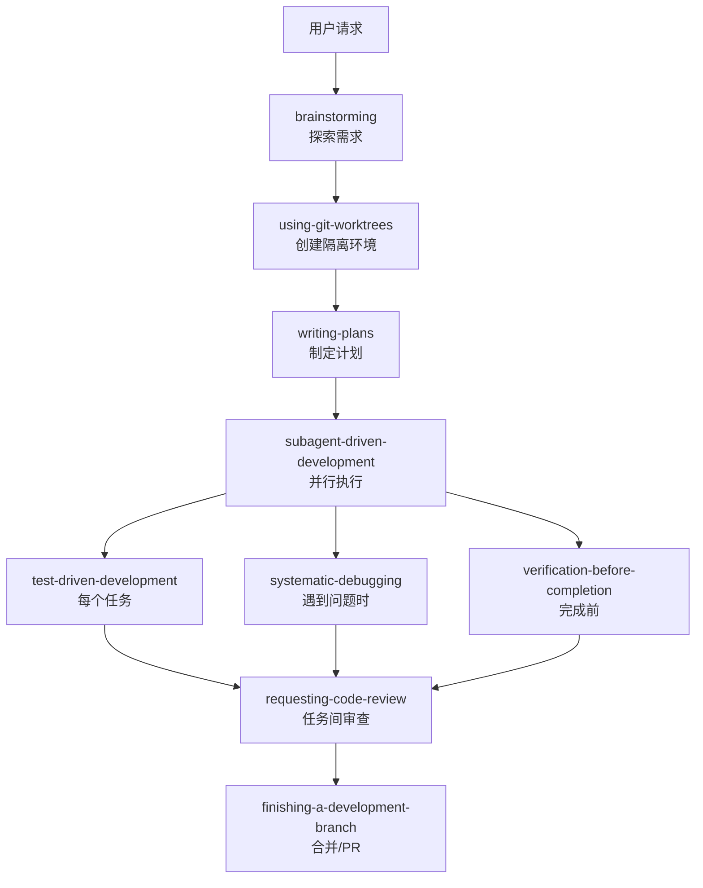

# Superpowers Skills 完整调研

> 调研时间：2026-01-11
> 调研目的：了解 obra/superpowers 的所有 skills 及其功能

## 仓库概览

| 仓库 | 描述 | 状态 |
|------|------|------|
| [obra/superpowers](https://github.com/obra/superpowers) | 核心 skills 库 | ⭐ 3,787+ stars |
| [obra/superpowers-lab](https://github.com/obra/superpowers-lab) | 实验性 skills | 活跃开发中 |
| [obra/superpowers-skills](https://github.com/obra/superpowers-skills) | 社区 skills (已归档) | 已合并到主仓库 |

## 核心 Skills 列表 (obra/superpowers)

### 一、协作类 Skills

| Skill | 触发时机 | 功能描述 |
|-------|----------|----------|
| **brainstorming** | 写代码前 | 通过提问细化需求，探索替代方案，分段验证设计，保存设计文档 |
| **requesting-code-review** | 任务间隙 | 对照计划审查，按严重程度报告问题，关键问题阻止进度 |
| **receiving-code-review** | 收到反馈时 | 处理代码评审反馈，技术严谨而非盲目同意 |

### 二、开发工作流 Skills

| Skill | 触发时机 | 功能描述 |
|-------|----------|----------|
| **using-git-worktrees** | 设计批准后 | 创建隔离工作区、新分支，运行项目设置，验证测试基线 |
| **writing-plans** | 有批准设计时 | 将工作拆分为小任务(2-5分钟)，包含精确文件路径、完整代码、验证步骤 |
| **executing-plans** | 有计划时 | 分批执行计划，带人工检查点 |
| **subagent-driven-development** | 有计划时 | 为每个任务派发新 subagent，两阶段审查(规格合规+代码质量) |
| **finishing-a-development-branch** | 任务完成时 | 验证测试，提供选项(合并/PR/保留/丢弃)，清理 worktree |

### 三、测试类 Skills

| Skill | 触发时机 | 功能描述 |
|-------|----------|----------|
| **test-driven-development** | 实现功能时 | 强制执行 RED-GREEN-REFACTOR 循环，先写失败测试，再写最小代码 |
| **verification-before-completion** | 声称完成前 | 验证修复是否真正生效，必须运行验证命令并确认输出 |

### 四、调试类 Skills

| Skill | 触发时机 | 功能描述 |
|-------|----------|----------|
| **systematic-debugging** | 遇到 bug/测试失败时 | 4阶段根因分析：重现→收集数据→分析根因→验证假设 |

> [!important] 核心原则
> "随机修复浪费时间并产生新 bug。快速补丁掩盖底层问题。"
> "**始终在尝试修复前找到根因**，症状修复是失败。"

### 五、元 Skills

| Skill | 功能描述 |
|-------|----------|
| **using-superpowers** | 核心引导 skill，确保 agent 在任务前检查相关 skills |
| **writing-skills** | 创建、测试、贡献新 skills 的指南 |
| **dispatching-parallel-agents** | 协调多个并行 subagent 工作 |

---

## 实验性 Skills (obra/superpowers-lab)

| Skill | 功能描述 |
|-------|----------|
| **using-tmux-for-interactive-commands** | 通过 tmux 会话控制交互式 CLI 工具 (vim, git rebase -i, REPL 等) |
| **remembering-conversations** | 复制对话记录到向量数据库，支持语义搜索历史对话 |

### tmux 工作流程

```
1. 创建分离会话运行交互命令
2. 等待初始化 (100-500ms)
3. 使用 send-keys 发送输入
4. 使用 capture-pane -p 捕获输出
5. 重复 3-4 直到完成
```

---

## 社区/架构类 Skills (已归档)

| Skill | 功能描述 |
|-------|----------|
| **preserving-productive-tensions** | 保持多个有效方案而非强制过早决策 |

---

## Skills 分类体系

```
superpowers/
├── 协作 (Collaboration)
│   ├── brainstorming
│   ├── requesting-code-review
│   └── receiving-code-review
├── 开发 (Development)
│   ├── using-git-worktrees
│   ├── writing-plans
│   ├── executing-plans
│   ├── subagent-driven-development
│   └── finishing-a-development-branch
├── 测试 (Testing)
│   ├── test-driven-development
│   └── verification-before-completion
├── 调试 (Debugging)
│   └── systematic-debugging
└── 元技能 (Meta)
    ├── using-superpowers
    ├── writing-skills
    └── dispatching-parallel-agents
```

---

## 安装方式

```bash
# 添加市场
/plugin marketplace add obra/superpowers-marketplace

# 安装核心 skills
/plugin install superpowers@superpowers-marketplace

# 安装实验性 skills (可选)
claude-code plugin install https://github.com/obra/superpowers-lab
```

---

## 典型工作流程



---

## 参考资料

- [obra/superpowers GitHub](https://github.com/obra/superpowers)
- [obra/superpowers-lab GitHub](https://github.com/obra/superpowers-lab)
- [obra/superpowers-skills GitHub](https://github.com/obra/superpowers-skills)
- [Superpowers Skills Library](https://skills.pawgrammer.com/skills/superpowers-skills-library)
- [systematic-debugging Skill](https://claude-plugins.dev/skills/@obra/superpowers/systematic-debugging)
- [Superpowers 博客](https://blog.fsck.com/2025/10/09/superpowers/)
- [Superpowers 深度解析](https://betazeta.dev/blog/claude-code-superpowers/)

---

## 相关笔记

- [[Superpowers命令大全]]
- [[Brainstorming技能详解]]
